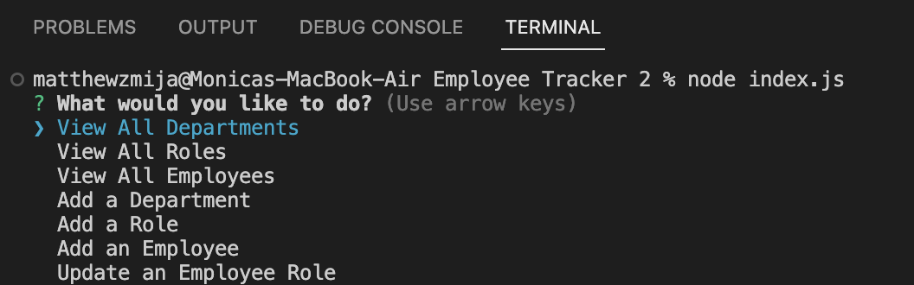

# Employee-Tracker

## Description

The task at hand was to build a command-line application from scratch to manage a company's employee database, using Node.js, Inquirer, and MySQL. This interface is intended to act as a content management system (CMS). This project was built to help non-developers to easily view and interact with information stored in databases. This is achieved by allowing the users to go through certain prompts and interact with the database in whichever way they desire

## Usage

The objectives that were completed to fulfill in creating a content management system are as follows...

- Created prompts for the user to select how they want to interact with the database
- Allow for the user to view and manage the specifics of the workplace such as departments, roles, and employees in the company
- This application lets the user organize and plan the business in an efficient manner

## Screenshots

### Opening screen of the command-line application

## URL of GitHub repository

https://github.com/matthewzmija/Employee-Tracker

## Video Presentation of how the application runs

https://www.youtube.com/watch?v=hjDMSMcPVUk

## License

MIT
